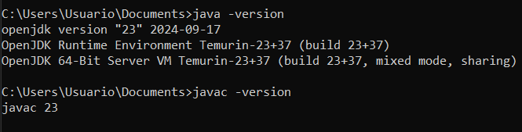

# Parte 1: Configuración del Entorno de Java

### Paso 1: Obtener la Ruta del Binario de Java
En lugar de instalar Java, vamos a tratar de utilizar la versión de Java ya instalada en nuestro IDE Eclipse.

1. **Abrir Eclipse.**
2. **Ir a** `Window > Preferences` (en macOS es `Eclipse > Preferences`).
3. **En la barra de búsqueda de la ventana de preferencias, escribir** "Installed JREs" o navegar a `Java > Installed JREs`.


4. **En la lista de JREs instaladas, seleccionar la JRE que aparece configurada** (debe tener una ruta que apunte a un directorio dentro de Eclipse, similar a `/Users/tusuario/.p2/pool/plugins/org.eclipse.justj.openjdk...`).


5. **Copiar la ruta completa del campo** `JRE home` que aparece en la ventana.

## Paso 2: Configurar Java en el PATH usando la Ruta Obtenida

### Para usuarios de Windows:

1. **Abrir el buscador de Windows**:
   - Haz clic en el icono de búsqueda en la barra de tareas o presiona `Win + S`.

2. **Buscar "Editar las variables de entorno del sistema"**:
   - Escribe `Editar las variables de entorno del sistema` en el cuadro de búsqueda.
   - Selecciona la opción que aparece en los resultados de búsqueda, como resutado se abre la ventana de la siguiente imagen:


3. **Acceder a Variables de entorno**:
   - En la ventana de Propiedades del sistema, haz clic en el botón `Variables de entorno...`.

4. **Editar la variable Path**:
   - En la sección "Variables del sistema", busca la variable `Path` y selecciónala.
   - Haz clic en `Editar`.

5. **Añadir una nueva ruta**:
   - En la ventana de edición de la variable Path, haz clic en `Nuevo`.
   - Añade la ruta completa al directorio `bin` de la JRE obtenida de Eclipse, por ejemplo: `C:\ruta\a\la\instalación\bin`.

   

6. **Guardar los cambios**:
   - Haz clic en `Aceptar` para guardar los cambios.
   - Cierra todas las ventanas de configuración.

## Paso 3: Verificar la Configuración
**En una nueva ventana de terminal, ejecutar java -version y javac -version para confirmar que el sistema reconoce la instalación de Java.**
 

 
 # Parte 2: Desarrollo y Empaquetado de la Aplicación

 ## Paso 4: Creación del Programa

 1. **Crear un archivo** `HelloWorld.java` **y editarlo.**

    - Desde un editor de texto creamos el archivo HelloWorld.java, dentro de este añadimos el siguiente código:

    `public class HelloWorld {`
    `public static void main(String[] args) {`
        `System.out.println("¡Hola, mundo!");`
    `}`
`}`
    La calse se tiene que llamar igual que el archivo, sino el lenguaje de programación java no s capaz de interpretarlo. Una vez creado lo guargamos con la extensión .java.

    

## Paso 5: Compilación del Programa

1. **Navegar al directorio donde está `HelloWorld.java`**:
   - Desde la línea de comandos con `cd` cambiamos al directorio que tiene el archivo `HelloWorld.java`. Por ejemplo:
     ```bash
     cd C:\ruta\al\archivo\HelloWorld.java
     ```

2. **Ejecutar `javac HelloWorld.java`**:  
   - Para compilar el archivo `HelloWorld.java` se usa el comando javac y genera un archivo `HelloWorld.class` en el mismo directorio. La compilación convierte el código fuente de Java en bytecode que puede ser ejecutado por la Máquina Virtual de Java (JVM).

   

3. **Verificar que el archivo `HelloWorld.class` se ha creado**:
   - Podemos comprovar desde el gestor de archivos que se a creado el archivo `HelloWorld.class`. Este archivo es el resultado de la compilación y contiene el bytecode del programa.
   

